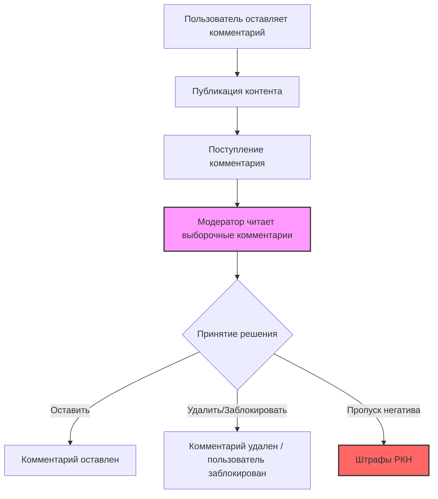
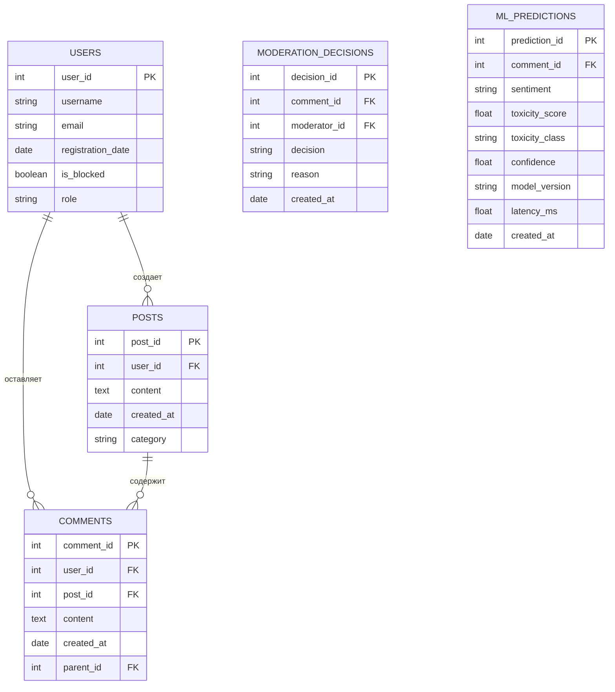
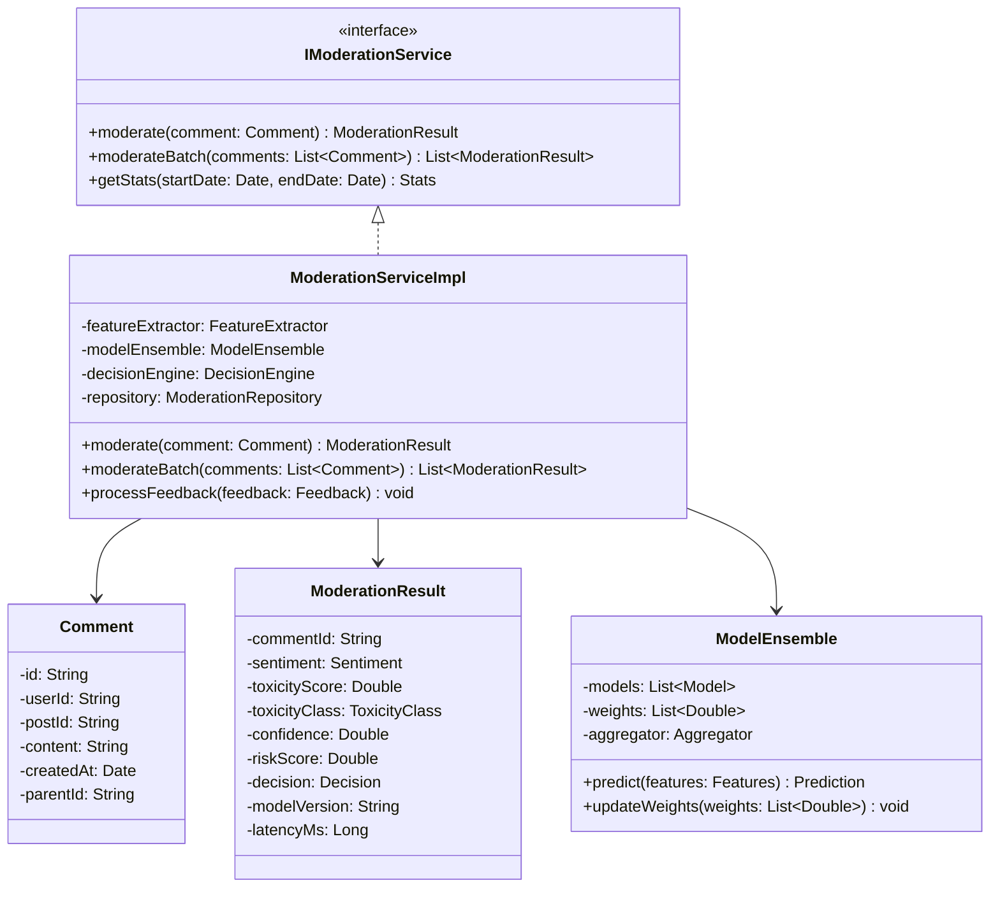
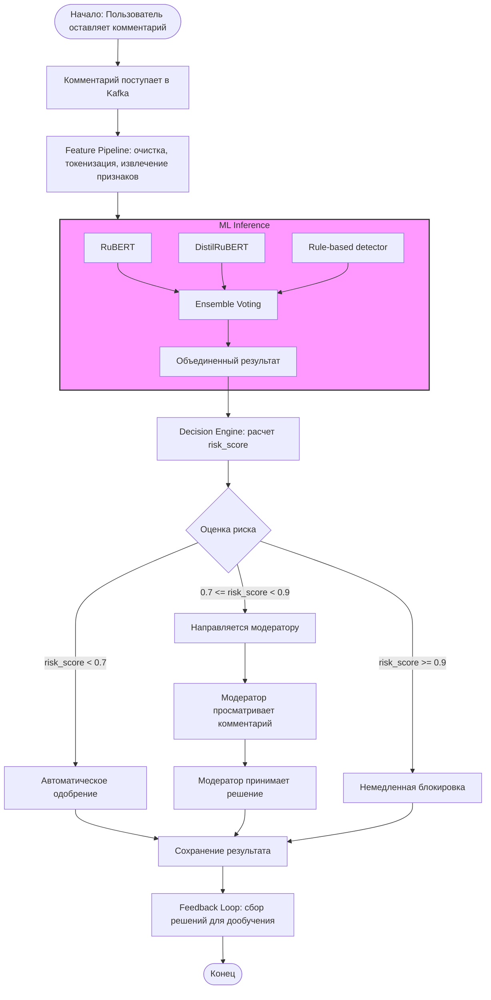

# MLSD-документ: Автоматизация мониторинга пользовательских реакций в соцсети

**Исполнитель:** Марков Ф.Д.  
**Версия:** 1.0  
**Дата:** 17.06.2026  

---


## Состав команды

| Роль | Имя | Ответственность |
|------|-----|-----------------|
| **Product Owner / Data Scientist** | *Марков Ф.Д.* | Бизнес-требования, постановка задачи, разработка и обучение ML-моделей, метрики качества |
| **Software Architect / Data Engineer** | *Марков Ф.Д* | Архитектура системы, инфраструктура, пайплайны данных, CI/CD, интеграция |
| **ML Engineer / Backend Developer** | *Марков Ф.Д* | Развертывание моделей, API-сервисы, мониторинг, оптимизация производительности |

---

## Содержание

1. [Цели и предпосылки](#1-цели-и-предпосылки)
2. [Методология](#2-методология)
3. [Подготовка пилота](#3-подготовка-пилота)
4. [Внедрение для production системы](#4-внедрение-для-production-системы)
5. [Бизнес-процессы (BPMN)](#5-бизнес-процессы-bpmn)
6. [Структура данных (ER-диаграмма)](#6-структура-данных-er-диаграмма)
7. [Архитектура системы](#7-архитектура-системы)
8. [Структурная UML-диаграмма (Классы)](#8-структурная-uml-диаграмма-классы)
9. [Поведенческая UML-диаграмма (Активности)](#9-поведенческая-uml-диаграмма-активности)
10. [Приложения](#приложения)

---

## 1. Цели и предпосылки

### 1.1 Зачем идем в разработку продукта?

- Упростить и ускорить процесс модерации комментариев, снизив долю ручной работы с 100% до ~10–20% (модераторы проверяют только спорные случаи).
- Обеспечить своевременное выявление негативных и потенциально опасных комментариев (угрозы, оскорбления, токсичность, экстремизм).
- Повысить качество модерации для соответствия требованиям РКН, избегая штрафов и блокировок.
- Улучшить пользовательский опыт и вовлеченность через своевременное реагирование на жалобы.
- Убрать элемент субъективности при проверке комментариев.

### 1.2 Почему станет лучше, чем сейчас, от использования ML?

| Аспект | Текущее состояние | С ML-системой |
|--------|-------------------|---------------|
| **Скорость** | Ручная проверка выборочных комментариев → ~500–1000 в день на модератора | Автоматическая классификация 500 000+ комментариев в день |
| **Объективность** | Высокая субъективность, зависимость от конкретного модератора | Нейросеть работает последовательно и одинаково для всех |
| **Масштабируемость** | Линейный рост затрат при росте объема | Легко адаптировать к новым языкам и форматам данных |
| **Качество** | Пропуск негатива → штрафы РКН | Непрерывное обучение и улучшение модели |
| **Стоимость** | Высокие затраты на FTE-модераторов | Снижение операционных расходов на 60–80% |

### 1.3 Бизнес-требования и ограничения

- **Точность выявления негатива**: F1-score ≥ 0.85 на целевых классах
- **Поддержка русского языка** и неформальной лексики/сленга
- **Прозрачность решений** модели (объяснимость для модераторов и регулятора)
- **Скорость обработки**: латентность ≤ 500 мс на комментарий в реальном времени
- **Соответствие требованиям** по обработке персональных данных (152-ФЗ)
- **Бюджет на инфраструктуру**: ограничен, требуется оптимизация затрат на GPU
- **Регуляторные требования**: возможность аудита решений модели

### 1.4 Функциональные требования

| ID | Требование | Приоритет |
|----|------------|-----------|
| FR-1 | Автоматическая классификация тональности комментариев (негатив/нейтрально/позитив) | P0 |
| FR-2 | Выявление токсичности, оскорблений, угроз, экстремистского контента | P0 |
| FR-3 | Приоритизация комментариев для ручной модерации по уровню риска | P0 |
| FR-4 | Дашборд для модераторов с визуализацией результатов и трендов | P1 |
| FR-5 | API для интеграции с существующей системой соцсети | P0 |
| FR-6 | Система отчетности о тональности для анализа контента | P1 |
| FR-7 | Механизм обратной связи (модератор корректирует решение → дообучение) | P1 |
| FR-8 | Поддержка мультимодального анализа (текст + эмодзи + метаданные) | P2 |

### 1.5 Нефункциональные требования

| ID | Требование | Целевое значение |
|----|------------|------------------|
| NFR-1 | Латентность обработки (p95) | ≤ 500 мс |
| NFR-2 | Пропускная способность | ≥ 600 запросов/сек (пиковая нагрузка) |
| NFR-3 | Доступность (SLA) | 99.9% |
| NFR-4 | Время восстановления (RTO) | ≤ 15 мин |
| NFR-5 | Горизонтальная масштабируемость | Автоматическое масштабирование при нагрузке |
| NFR-6 | Безопасность данных | Шифрование at-rest и in-transit |
| NFR-7 | Аудит | Логирование всех предсказаний для проверки РКН |

### 1.6 Процесс пилота и критерии успеха

**Пилотный процесс:**
1. **Неделя 1-2**: Сбор и разметка исторических данных (50 000 комментариев)
2. **Неделя 3-4**: Обучение baseline-модели и офлайн-оценка
3. **Неделя 5-6**: Развертывание shadow-режима (модель работает параллельно с модераторами, но решения не применяются)
4. **Неделя 7-8**: A/B-тест на 10% трафика
5. **Неделя 9-10**: Анализ результатов, дообучение, принятие решения о rollout

**Критерии успеха пилота:**
- **Бизнес-критерии**: Сокращение времени модерации на ≥ 70%
- **ML-критерии**: F1-score ≥ 0.82 на тестовой выборке
- **Операционные критерии**: Латентность ≤ 600 мс при нагрузке 100 RPS
- **Юридические критерии**: Отсутствие ложных срабатываний по экстремизму (Recall ≥ 0.95)

### 1.7 MVP vs технический долг

**Входит в MVP:**
- Модель классификации тональности (3 класса) на базе fine-tuned BERT/RuBERT
- REST API для синхронной обработки комментариев
- Базовый дашборд для модераторов
- Интеграция с очередью сообщений (Kafka)
- Мониторинг основных метрик (латентность, throughput, качество)

**Технический долг (отложено):**
- Мультимодальный анализ (изображения, видео)
- Детекция сарказма и иронии
- Онлайн-дообучение (online learning)
- Полноценная MLOps-платформа (Kubeflow/MLflow)
- Многопоточная асинхронная обработка батчей
- Поддержка дополнительных языков

---

## 2. Методология

### 2.1 Постановка задачи с технической точки зрения

Задача формулируется как **многоклассовая классификация** текстовых комментариев с дополнительным **бинарным детектированием токсичности**:

- **Основная задача**: Классификация тональности (негатив / нейтрально / позитив)
- **Дополнительная задача**: Бинарная классификация (токсичный / нетоксичный) с выделением подклассов (оскорбление, угроза, экстремизм, спам)

Возможен переход к **multilabel classification** для одновременного определения нескольких признаков.

### 2.2 Данные

**Критические данные (без чего решение невозможно):**

| Тип данных | Источник | Описание |
|------------|----------|----------|
| Текст комментария | База данных соцсети | Основной входной сигнал |
| Метаданные комментария | База данных соцсети | ID пользователя, ID поста, timestamp, длина |
| Разметка тональности | Исторические решения модераторов + краудсорсинг | Целевые переменные для обучения |
| Контекст поста | База данных соцсети | Тема, категория, автор (для контекстуального анализа) |

**Дополнительные данные (желательны):**
- Эмодзи и спецсимволы
- История пользователя (предыдущие комментарии)
- Реакции других пользователей (лайки, жалобы)

**Объем данных**: ~500 000 комментариев в день, для обучения необходимо ≥ 100 000 размеченных примеров.

### 2.3 Метрики качества

| Метрика | Формула | Связь с бизнесом |
|---------|---------|------------------|
| **F1-score (macro)** | Гармоническое среднее precision/recall | Баланс полноты и точности — минимизация штрафов РКН |
| **Precision (токсичность)** | TP / (TP + FP) | Снижение ложных блокировок → улучшение UX |
| **Recall (токсичность)** | TP / (TP + FN) | Минимизация пропущенного негатива → снижение риска штрафов |
| **AUC-ROC** | Площадь под ROC-кривой | Общая разделяющая способность модели |
| **Латентность (p95)** | — | Влияет на пользовательский опыт |
| **Коэффициент ручной проверки** | % комментариев, отправленных модератору | Прямая экономия на FTE |

**Связь с бизнес-результатом:**
- Увеличение Recall по токсичности на 10% → снижение риска штрафов РКН на 30%
- Снижение доли ручной проверки с 100% до 15% → экономия ~85% трудозатрат модераторов

### 2.4 Риски на этапе анализа и моделирования

| Риск | Вероятность | Влияние | План mitigation |
|------|-------------|---------|-----------------|
| **Дисбаланс классов** | Высокое | Среднее | Использование weighted loss, SMOTE, фокус-потеря |
| **Низкое качество разметки** | Среднее | Высокое | Механизм согласования разметчиков (Kappa > 0.7) |
| **Сленг и неформальная лексика** | Высокое | Среднее | Fine-tune на корпусе социальных сетей, использование BPE-токенизации |
| **Дрейф данных (concept drift)** | Среднее | Высокое | Регулярное переобучение (weekly retraining), мониторинг распределений |
| **Вычислительные ограничения** | Среднее | Среднее | Использование дистиллированных моделей (DistilBERT, ONNX-оптимизация) |
| **Атаки на модель (adversarial)** | Низкое | Высокое | Аугментация данных, adversarial training |

---

## 3. Подготовка пилота

### 3.1 Способ оценки пилота

- **Shadow-mode deployment**: Модель работает параллельно с существующим процессом модерации в течение 2 недель
- **A/B-тест**: 10% трафика направляется на ML-обработку, сравнение с контрольной группой (manual moderation)
- **Офлайн-валидация**: Hold-out валидация (80/20 split) с стратификацией по классам

### 3.2 Критерии успешного пилота

| Критерий | Порог успеха | Способ измерения |
|----------|--------------|------------------|
| F1-score (macro) | ≥ 0.82 | Офлайн-тест на отложенной выборке |
| Recall по токсичности | ≥ 0.90 | Офлайн-тест |
| Латентность (p95) | ≤ 600 мс | Мониторинг в shadow-режиме |
| Снижение ручной проверки | ≥ 60% | Сравнение с baseline |
| User feedback accuracy | ≥ 80% | Согласие с решениями модераторов |

### 3.3 Подготовка пилота

1. **Сбор данных**: Выгрузка 100 000+ комментариев за последние 3 месяца
2. **Разметка**: Краудсорсинг + эксперты-модераторы (3 разметчика на пример)
3. **Предобработка**: Очистка, лемматизация, токенизация, удаление PII
4. **Обучение baseline**: 
   - Модель 1: Logistic Regression + TF-IDF (baseline)
   - Модель 2: Fine-tuned RuBERT (основная)
   - Модель 3: DistilRuBERT (для production)
5. **Валидация**: Cross-validation (5-fold) + test set
6. **Экспорт модели**: Конвертация в ONNX/TorchScript для инференса

---

## 4. Внедрение для production системы

### 4.1 Архитектура решения

*Подробная диаграмма архитектуры представлена в разделе [7. Архитектура системы](#7-архитектура-системы).*

**Ключевые компоненты:**
- **Ingestion Layer**: Apache Kafka (comment-stream, feedback-stream)
- **Processing Layer**: Apache Flink (feature extraction, очистка)
- **ML Inference**: KServe + Triton Inference Server (модели RuBERT, DistilRuBERT)
- **Decision Engine**: риск-скоринг, пороговые правила
- **Storage Layer**: PostgreSQL (метаданные), ClickHouse (аналитика), S3 (артефакты), Redis (кэш)
- **Moderation Dashboard**: интерфейс для модераторов
- **Feedback Loop**: сбор решений модераторов для дообучения

### 4.2 Распределенный характер хранения данных

Данные распределены по следующим причинам:

| Хранилище | Тип данных | Причина распределения |
|-----------|------------|----------------------|
| **PostgreSQL** | Метаданные, решения модерации | Транзакционная нагрузка, ACID-требования |
| **ClickHouse** | Аналитика, метрики, дашборды | Колоночное хранение для OLAP-запросов, высокая скорость агрегации |
| **S3/MinIO** | Модели, эмбеддинги, обучающие данные | Объем больших файлов, versioning, доступность |
| **Kafka** | Потоковые данные | Буферизация, fault-tolerance, репликация |
| **Redis** | Кэш эмбеддингов | Низкая латентность, in-memory |

### 4.3 Описание инфраструктуры и масштабируемости

**Выбранная инфраструктура**: Гибридная (on-premise + cloud) с использованием Kubernetes

| Компонент | Выбор | Обоснование |
|-----------|-------|-------------|
| **Оркестрация** | Kubernetes (k8s) | Горизонтальное масштабирование, self-healing, rolling updates |
| **ML-инференс** | KServe / Triton Inference Server | Поддержка GPU, batching, model versioning |
| **Стриминг** | Apache Kafka | Высокая пропускная способность, persistence, replay |
| **Feature Store** | Feast / custom | Единый источник признаков для train и serve |
| **Мониторинг** | Prometheus + Grafana | Открытый стек, широкие возможности интеграции |
| **Логирование** | ELK Stack | Централизованное логирование, поиск, визуализация |
| **MLOps** | MLflow + Kubeflow | Отслеживание экспериментов, пайплайны, регистрация моделей |

**Плюсы:**
- Горизонтальное масштабирование при росте нагрузки
- Изоляция компонентов (microservices)
- Возможность канареечных релизов и A/B-тестов
- Единый стек для dev/staging/prod

**Минусы:**
- Сложность начальной настройки
- Overhead на оркестрацию
- Требует квалифицированной DevOps-команды

### 4.4 Требования к работе системы

| Параметр | Значение | Комментарий |
|----------|----------|-------------|
| **SLA** | 99.9% | ~8.76 часов простоя в год |
| **RPS (пиковая)** | ≥ 600 запросов/сек | 500K комментариев/день = ~6 RPS в среднем, пик ×10 |
| **Latency (p95)** | ≤ 500 мс | Для синхронной обработки |
| **Throughput (батч)** | ≥ 10 000 комм/мин | Для ночной обработки исторических данных |
| **Model refresh** | Еженедельно | Переобучение на новых данных |
| **Data retention** | 6 месяцев | Для соответствия регуляторным требованиям |
| **Error rate** | < 0.1% | Ошибки инференса |

### 4.5 Риски и неопределенности

| Риск | Вероятность | Влияние | Mitigation |
|------|-------------|---------|------------|
| **Дрейф данных** | Высокое | Высокое | Мониторинг распределений, автоматическое переобучение, канареечные деплои |
| **Регуляторные изменения** | Среднее | Высокое | Гибкая архитектура, возможность быстрой смены правил классификации |
| **Отказ GPU** | Низкое | Высокое | GPU-пул с автоматическим переключением, fallback на CPU (медленнее) |
| **Атаки на модель** | Низкое | Среднее | Adversarial validation, мониторинг выбросов |
| **Утечка данных** | Низкое | Критическое | Шифрование, маскировка PII, аудит доступа |
| **Некорректная разметка** | Среднее | Среднее | MLOps-пайплайн с проверкой качества разметки (Kappa, конфликтные примеры) |
| **Простой Kafka** | Низкое | Высокое | Репликация, multi-AZ, мониторинг Consumer Lag |
| **Рост стоимости GPU** | Среднее | Среднее | Оптимизация модели (дистилляция, квантование), spot-инстансы |

---

## 5. Бизнес-процессы (BPMN)

### 5.1 Модель AS-IS (текущий процесс)


### 5.2 Модель TO-BE (целевой процесс)

```mermaid
graph TD
    A[Пользователь оставляет комментарий] --> B[Публикация контента]
    B --> C[Поступление комментария]
    C --> D[ML-система автоматически классифицирует тональность]
    D --> E{Оценка риска}
    E -->|Низкий риск (score < 0.7)| F[Автоматическое одобрение]
    E -->|Высокий риск (score >= 0.7)| G[Направляется модератору]
    F --> H[Комментарий опубликован]
    G --> I[Модератор принимает решение]
    I --> J[Обратная связь → дообучение модели]
    I --> K[Комментарий удален/заблокирован]

    style D fill:#9cf,stroke:#333,stroke-width:2px
    style F fill:#9f9,stroke:#333,stroke-width:2px
    style J fill:#fc9,stroke:#333,stroke-width:2px
```

**Ключевые изменения, которые вносит ML-система:**
- **Автоматизация** → замещение ручного труда на 85% потока
- **Масштабирование** → обработка 100% комментариев вместо выборочной проверки
- **Объективность** → единые критерии оценки вместо субъективных решений
- **Прозрачность** → возможность аудита каждого решения для РКН
- **Обратная связь** → непрерывное улучшение модели на основе решений модераторов

---

## 6. Структура данных (ER-диаграмма)

### Реляционная модель (PostgreSQL + ClickHouse)



---

## 7. Архитектура системы

### 7.1 Компоненты и их взаимосвязи



### 7.2 Поток данных (Data Flow)


---

## 8. Структурная UML-диаграмма (Классы)


---

## 9. Поведенческая UML-диаграмма (Активности)


---

## Приложения

### Приложение A: Технический стек

| Категория | Технологии |
|-----------|------------|
| **Языки** | Python 3.10+, Java/Scala (Flink) |
| **ML-фреймворки** | PyTorch, Hugging Face Transformers, scikit-learn |
| **Модели** | RuBERT, DistilRuBERT, Logistic Regression (baseline) |
| **Оркестрация** | Kubernetes, Helm, Istio |
| **ML-платформа** | KServe, Triton Inference Server, MLflow |
| **Стриминг** | Apache Kafka, Apache Flink |
| **Базы данных** | PostgreSQL, ClickHouse, Redis |
| **Хранилище** | S3 / MinIO |
| **Мониторинг** | Prometheus, Grafana, ELK Stack |
| **CI/CD** | GitHub Actions, ArgoCD |
| **Feature Store** | Feast (опционально) |

### Приложение B: Метрики мониторинга в production

| Метрика | Описание | Порог тревоги |
|---------|----------|---------------|
| `model_latency_p95` | 95-й перцентиль латентности | > 500 мс |
| `model_throughput` | Запросов в секунду | < 400 RPS |
| `model_error_rate` | Доля ошибок инференса | > 0.1% |
| `sentiment_distribution` | Распределение тональности | Дрейф > 10% за неделю |
| `toxicity_rate` | Доля токсичных комментариев | Аномальный рост > 2σ |
| `auto_approval_rate` | Доля автоматически одобренных | < 75% или > 90% |
| `human_review_queue_size` | Размер очереди на модерацию | > 10 000 |
| `feedback_agreement` | Согласие модератора с ML | < 80% |
| `gpu_utilization` | Использование GPU | > 90% или < 20% |
| `kafka_consumer_lag` | Отставание потребителя Kafka | > 100 000 сообщений |

---
 
*Исполнитель: Марков Ф.Д.*  
*Версия 1.0, 17.06.2026*